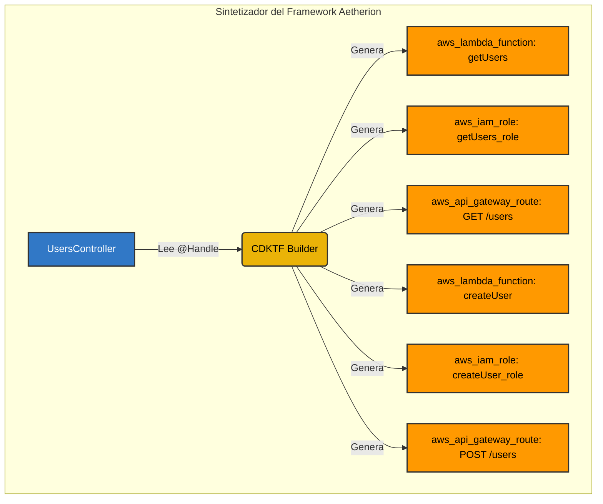

La mayoría de los frameworks Serverless operan bajo un patrón de "Lambdalith" (Monolito Lambda). En un Lambdalith, todas las rutas de tu aplicación se empaquetan en una única función AWS Lambda, la cual intercepta el evento de API Gateway y lo enruta internamente (como una aplicación Express.js ejecutándose dentro de Lambda).

**Aetherion adopta un enfoque fundamentalmente distinto.**

## El Enfoque Aetherion

En Aetherion, imponemos una estricta **Arquitectura 1:1**. Cada método individual en tu controlador que esté decorado con `@Handle` se convierte en una función AWS Lambda físicamente distinta e independiente.

### ¿Por qué 1:1?

1. **Seguridad (Menor Privilegio):** Un Lambdalith requiere un Rol IAM que pueda acceder a *todo* lo que la aplicación necesita. En Aetherion, la Lambda `getUser` solo obtiene permisos para leer de la tabla de Usuarios, mientras que la Lambda `deleteUser` obtiene permisos para eliminar.
2. **Cold Starts:** Lambdas más pequeñas y atómicas tienen tamaños de paquete significativamente menores y cold starts más rápidos.
3. **Radio de Impacto (Blast Radius):** Si un endpoint falla por un error de falta de memoria, el resto de tu API permanece inalterada.

## Diagrama de Arquitectura

Así es como Aetherion convierte tus clases de TypeScript en infraestructura CDKTF (Terraform) durante el proceso `aetherion synth`.

## Cómo Funciona

Durante la fase de síntesis, Aetherion lee el `MetadataRegistry`. Itera sobre cada controlador y cada método. Por cada `@Handle`, instruye a CDKTF para aprovisionar:

1. Un recurso `aws_lambda_function` único.
2. Un recurso `aws_iam_role` único adjunto exclusivamente a esa función.
3. Una política inline `aws_iam_role_policy` generada a partir de tu decorador `@IamPermissions`.
4. Una ruta `aws_api_gateway_route` mapeando el endpoint a la Lambda específica.

En tiempo de ejecución, se despliega una única base de código físico, ¡pero las variables de entorno de la Lambda (`AETHERION_TARGET_METHOD`) le indican al framework que ejecute inmediatamente el método específico y pase por alto todo el enrutamiento interno!
