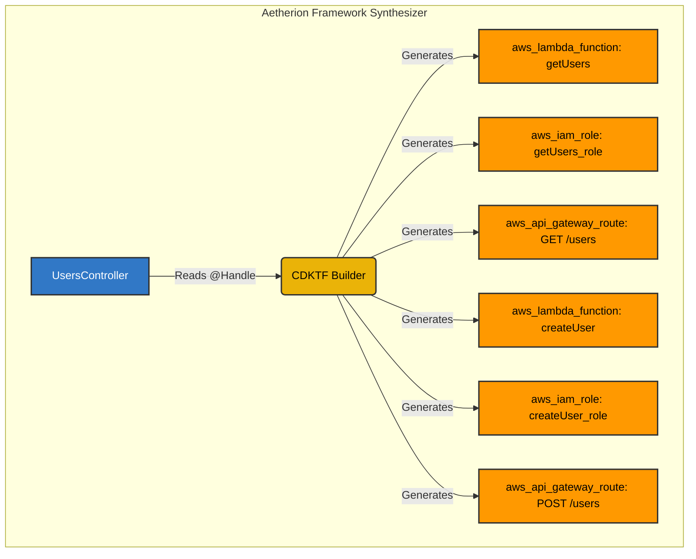

Most Serverless frameworks operate on a "Lambdalith" (Lambda Monolith) pattern. In a Lambdalith, all your application routes are bundled into a single AWS Lambda function, which intercepts the API Gateway event and routes it internally (like an Express.js app running inside Lambda).

**Aetherion takes a fundamentally different approach.**

## The Aetherion Approach

In Aetherion, we enforce a strict **1:1 Architecture**. Every single method in your controller that is decorated with `@Handle` becomes a physically distinct, independent AWS Lambda function.

### Why 1:1?

1. **Security (Least Privilege):** A Lambdalith requires an IAM Role that can access *everything* the application needs. In Aetherion, the `getUser` Lambda only gets permission to read from the Users table, while the `deleteUser` Lambda gets permission to delete.
2. **Cold Starts:** Smaller, atomic Lambdas have significantly smaller bundle sizes and faster cold starts.
3. **Blast Radius:** If one endpoint crashes due to an out-of-memory error, the rest of your API remains unaffected.

## Architecture Diagram

Here is how Aetherion converts your TypeScript classes into Terraform CDKTF infrastructure during the `aetherion synth` process.

## How It Works

During the synthesis phase, Aetherion reads the `MetadataRegistry`. It iterates over every controller and every method. For each `@Handle`, it instructs CDKTF to provision:

1. A unique `aws_lambda_function` resource.
2. A unique `aws_iam_role` attached exclusively to that function.
3. An inline `aws_iam_role_policy` generated from your `@IamPermissions` decorator.
4. An `aws_api_gateway_route` (or similar trigger) mapping the endpoint to the specific Lambda.

At runtime, the single physical codebase is deployed, but the Lambda's environment variables (`AETHERION_TARGET_METHOD`) instruct the framework to immediately execute the specific method and bypass all internal routing!
